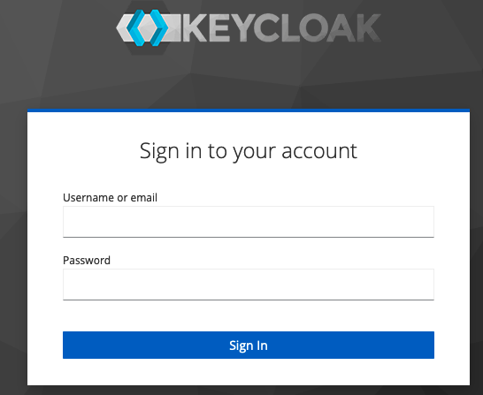
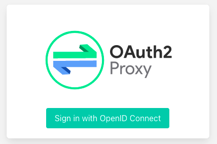
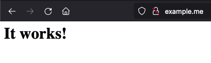

# IAM (Identity & Access Manager) Keycloak + Oauth2 Proxy + Apache HTTP

Este proyecto es un docker compose que arma un entorno de Identity & Access Manager (IAM) sin la necesidad de escribir codigo.

La finalidad es el de proteger una web app y/o una API REST, sin tener que codear un modulo de login/SSO.

## Entorno utilizado

- Docker version 20.10.12, build e91ed57
- Keycloak 18.0.0
- Oauth2 Proxy 7.3.0
- Apache HTTP 2.4

## Configura el archivo /etc/hosts

Agregar las siguientes lineas:

127.0.0.1 example.me
127.0.0.1 idp.example.me

## Crear docker network

desde la linea de comandos, ejecutar las siguiente linea:

$ docker network create proxy

## Iniciar IAM

desde la linea de comandos, ejecutar las siguiente linea:

$ docker-compose up -d

Salida por consola:

Creating keycloak ... done  
Creating apache_http ... done  
Creating oauth2-proxy ... done

## Detener IAM

desde la linea de comandos, ejecutar las siguiente linea:

$ docker-compose down

Salida por consola:

Stopping oauth2-proxy ... done  
Stopping apache_http  ... done  
Stopping keycloak     ... done  
Removing oauth2-proxy ... done  
Removing apache_http  ... done  
Removing keycloak     ... done  
Network proxy is external, skipping

## Ingresar a la consola de Keycloak

Desde un navegador, ingresar a la url http://idp.examplo.me:8080/admin/

Utilizar las credenciales admin/admin

## Crear el usuario con permisos para ver la web protegida

Ya dentro de la consola de administracion de Keycloak, ir al menu:

- Realm Master -> Manage -> Users
- Click en el boton "Add user"
- Completar los campos

Username: test  
Email: test@example.me  
First Name: Test  
Last Name: Example  
User Enabled: ON  
Email verified: ON  
Groups:   
Required User Actions:   

- Click en el boton "Save"

Al guardar se igresa automaticamente al modo de edicion del usuario.

- Click en la solapa "Credentials"
- Completar el password y la confirmacion con "test"/"test"
- Temporary: OFF
- Click en el boton "Reset Password"

## Crear el cliente que protege nuestra web

Ya dentro de la consola de administracion de Keycloak, ir al menu:

- Realm Master -> Configure -> Clients
- Click en el boton "Create"
- Completar los campos

Client ID: oauth2-proxy  
Name: Oauth2 Proxy  
Enable: ON  
Client Protocol: openid-connect  
Access Type: confidential  
Standard Flow Enabled: ON  
Direct Access Grants Enabled: ON  
Valid Redirect URIs: http://example.me:80/oauth2/callback  

- Click en el boton "Save"
- Bajar y volver a ejecutar docker compose

## Ingresar a la web protegida

Ingresar a http://example.me/

Click en el boton "Sign in with OpenID Connect"

Igresar la credenciales:
- User: test
- Password: test

Al hacer click en el boton "Sign In", se debe presentar la pantalla de bienvenida del Apache HTTP

